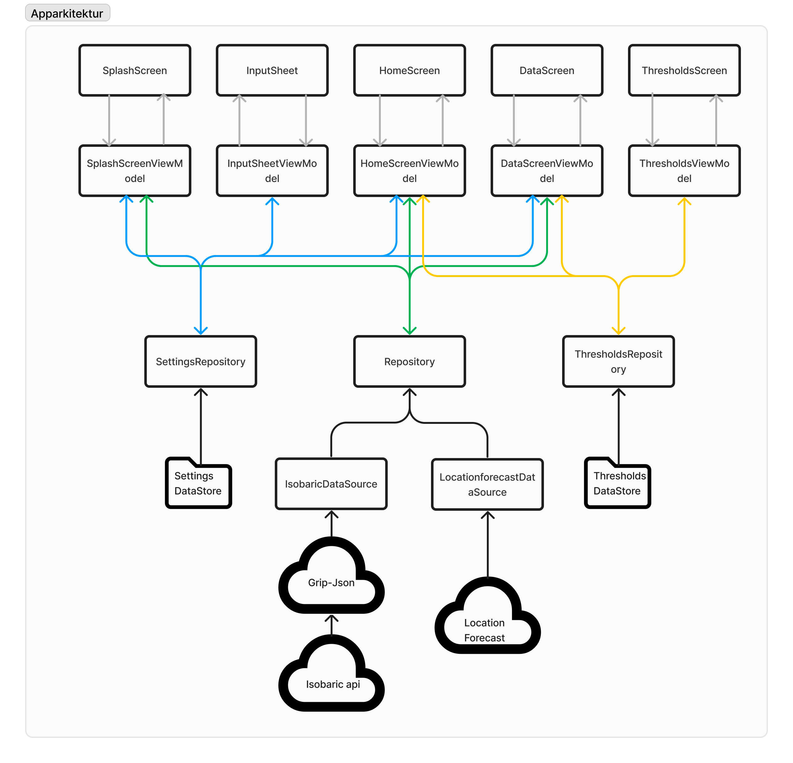

# Arkitekturen vår
#### Vi har etter beste evne implementert [Modern App Architecture](https://developer.android.com/topic/architecture#modern-app-architecture). Definisjonen av dette fra [developer.android.com](https://developer.android.com/topic/architecture) definerer det slik:
This Modern App Architecture encourages using the following techniques, among others:

* A reactive and layered architecture.
* Unidirectional Data Flow (UDF) in all layers of the app.
* A UI layer with state holders to manage the complexity of the UI.
* Coroutines and flows.
* Dependency injection best practices.

Vi har implementert tre distinkte lag som komuniserer med hverandre:

#### UI Layer:
Her inngår alt under app/src/main/java/no/uio/ifi/in2000/team_17/ui. Det er inndelt i de forskjellige skjermene våre, der skjermer som trenger det har en viewModel som utfører logic for å kunn eksponere den dataen som trengs til skjermen gjennom ui-states. 

#### Data Layer: 
Her inngår alt i packagen [data](app/src/main/java/no/uio/ifi/in2000/team_17/data). Vi har forskjellige repositories der tanken bak inndelingen er at hvert repository har ansvar for en "type" data slik at hver view-model får så lite unødvendig data som mulig. Hoved repositoryet [Repository.kt](app/src/main/java/no/uio/ifi/in2000/team_17/data/Repository.kt) henter data fra de to data sourcene våre og eksponerer dataen ut til view-modelsene. den har også en funksjon load som laster data fra en gitt posisjon. 

#### Domain Layer: 
Vi har også et lite domain layer som består av [useCases](app/src/main/java/no/uio/ifi/in2000/team_17/usecases). Her ar vi classer med metoder som utfører mer avansert logikk for å få et ekstra abstraksjonsnivå.

# Viktige objektorienterte prinsipper
Vi opprettholder viktige objektorienterte prinsipper ved å bruke MVVM, UDF og lav kobling og høy koheshon. 

#### MVVM
  * Model:
    * Klassen WeatherDataLists er vår hovedmodell som eksponeres ut fra Repository og inn til view modelsene som skal vise værdata. 
  * View:
    * Hver skjerm tar inn en viewModel(om nødvendig) og collecter en ui-state fra denne viewModelen. Om noe skal endres har viewModelen en metode for dette som er det eneste vi forholder oss til i skjermene
  * View Model:
    * Vi har flere view models som henter relevant data til sin tilhørende skjerm og eksponerer den ut via en ui-state. Om noe skal endres på som for eksempel posisjonen har viewModelen en metode for dette som kaller på riktig metode i riktig repository. 

#### UDF
* UDF blir opprettholdt litt via vår implementering av MVVM. Alle skjermene har en flyt med data inn og en eller flere "tuneller" tilbake til viewModelen sin om noe skal endres. Hver viewModel får data fra nødvendige repositories og bruker combine om den må høre på flere flows. Dette gjør at Skjermene blir oppdatert uansett hvor en instilling eller lignende blir oppdatert fra. 

#### Høy koheshon, lav kobling
  Vi kobler kun sammen de komponentene som faktisk trenger å kobles sammen. For eksempel skal [ThresholdsScreen](app/src/main/java/no/uio/ifi/in2000/team_17/ui/thresholds/ThresholdsScreen.kt) kun vise og endre satte Thresholds. Skjermen er koblet til sin tilsvarende view Model ved at den collekter en uiState fra en StateFlow og kaller på view-modelen sine metoder når den skal oppdatere et threshold. View-modelen på sin side har kunn tilgang til ThresholdsRepository da den ikke trenger å vise frem noen annen data. Når en Threshold oppdateres skrives det til en fil via [proto DataStore](https://developer.android.com/topic/libraries/architecture/datastore) og det eksponeres som en flow ut til alle de view-modelsene som trenger dataen. Da vil for eksempel [HomeScreenViewModel](app/src/main/java/no/uio/ifi/in2000/team_17/ui/home_screen/HomeScreenViewModel.kt) få beskjed om at det har vert en endring i Thresholds flowen og den vil oppdatere ui-staten til HomeScreen. Denne illustrasjonen viser godt hvordan ting er koblet sammen: 

  

