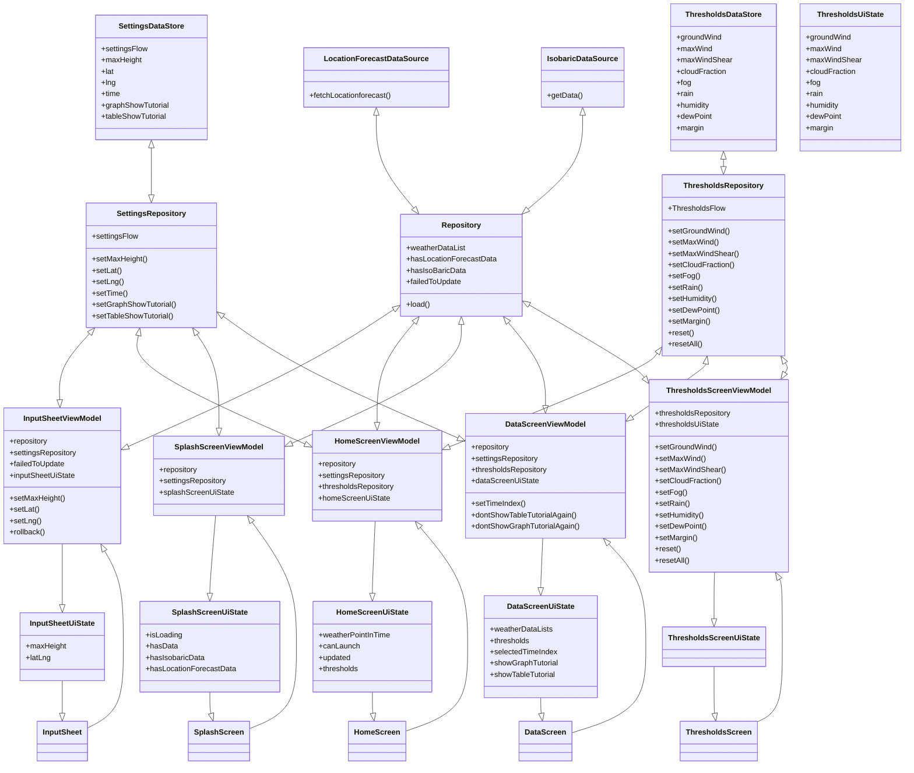

```mermaid
classDiagram 
    LocationForecastDataSource <|--|> Repository
    IsobaricDataSource <|--|> Repository

    SettingsDataStore <|--|> SettingsRepository

    ThresholdsDataStore <|--|> ThresholdsRepository

    Repository <|--|> InputSheetViewModel
    SettingsRepository <|--|> InputSheetViewModel 

    Repository <|--|> HomeScreenViewModel
    SettingsRepository <|--|> HomeScreenViewModel
    ThresholdsRepository <|--|> HomeScreenViewModel

    Repository <|--|> SplashScreenViewModel
    SettingsRepository <|--|> SplashScreenViewModel 

    Repository <|--|> DataScreenViewModel 
    ThresholdsRepository <|--|> DataScreenViewModel
    SettingsRepository <|--|> DataScreenViewModel

    Repository <|--|> ThresholdsScreenViewModel
    ThresholdsRepository <|--|> ThresholdsScreenViewModel 

    DataScreenViewModel --|> DataScreenUiState
    DataScreenUiState --|> DataScreen
    DataScreen --|> DataScreenViewModel

    InputSheetViewModel --|> InputSheetUiState
    InputSheetUiState --|> InputSheet
    InputSheet --|> InputSheetViewModel

    HomeScreenViewModel --|> HomeScreenUiState
    HomeScreenUiState --|> HomeScreen
    HomeScreen --|> HomeScreenViewModel

    SplashScreenViewModel --|> SplashScreenUiState
    SplashScreenUiState --|> SplashScreen
    SplashScreen --|> SplashScreenViewModel

    ThresholdsScreenViewModel --|> ThresholdsScreenUiState
    ThresholdsScreenUiState --|> ThresholdsScreen
    ThresholdsScreen --|> ThresholdsScreenViewModel


    class Repository{
        +weatherDataList
        +hasLocationForecastData
        +hasIsoBaricData
        +failedToUpdate
        +load()
    }
    class SettingsRepository{
        +settingsFlow
        +setMaxHeight()
        +setLat()
        +setLng()
        +setTime()
        +setGraphShowTutorial()
        +setTableShowTutorial()
    }
    class ThresholdsRepository{
        +ThresholdsFlow
        +setGroundWind()
        +setMaxWind()
        +setMaxWindShear()
        +setCloudFraction()
        +setFog()
        +setRain()
        +setHumidity()
        +setDewPoint()
        +setMargin()
        +reset()
        +resetAll()
    }

    class SettingsDataStore{
        +settingsFlow
        +maxHeight
        +lat
        +lng
        +time
        +graphShowTutorial
        +tableShowTutorial
    }

    class ThresholdsDataStore{
        +groundWind
        +maxWind
        +maxWindShear
        +cloudFraction
        +fog
        +rain
        +humidity
        +dewPoint
        +margin
    }

    class LocationForecastDataSource{
        +fetchLocationforecast()
    }

    class IsobaricDataSource{
        +getData()
    }

    class InputSheetViewModel{
        +repository
        +settingsRepository
        +failedToUpdate
        +inputSheetUiState
        +setMaxHeight()
        +setLat()
        +setLng()
        +rollback()
    }

    class InputSheetUiState{
        +maxHeight
        +latLng
    }

    class HomeScreenViewModel{
        +repository
        +settingsRepository
        +thresholdsRepository
        +homeScreenUiState
    }
    class HomeScreenUiState{
        +weatherPointInTime
        +canLaunch
        +updated
        +thresholds
    }

    class DataScreenViewModel{
        +repository
        +settingsRepository
        +thresholdsRepository
        +dataScreenUiState
        +setTimeIndex()
        +dontShowTableTutorialAgain()
        +dontShowGraphTutorialAgain()
    }

    class DataScreenUiState{
        +weatherDataLists
        +thresholds
        +selectedTimeIndex
        +showGraphTutorial
        +showTableTutorial
    }

    class SplashScreenViewModel{
        +repository
        +settingsRepository
        +splashScreenUiState
    }

    class SplashScreenUiState{
        +isLoading
        +hasData
        +hasIsobaricData
        +hasLocationForecastData
    }

    class ThresholdsScreenViewModel{
        +thresholdsRepository
        +thresholdsUiState
        +setGroundWind()
        +setMaxWind()
        +setMaxWindShear()
        +setCloudFraction()
        +setFog()
        +setRain()
        +setHumidity()
        +setDewPoint()
        +setMargin()
        +reset()
        +resetAll()
    }
    
    class ThresholdsUiState{
        +groundWind
        +maxWind
        +maxWindShear
        +cloudFraction
        +fog
        +rain
        +humidity
        +dewPoint
        +margin
    } 
```