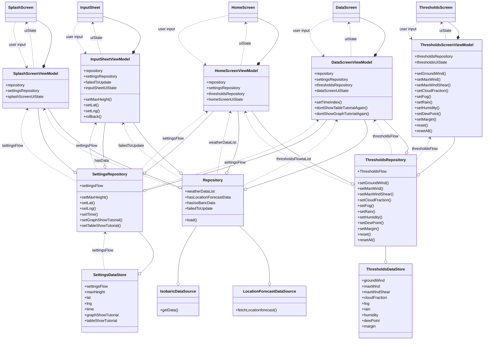
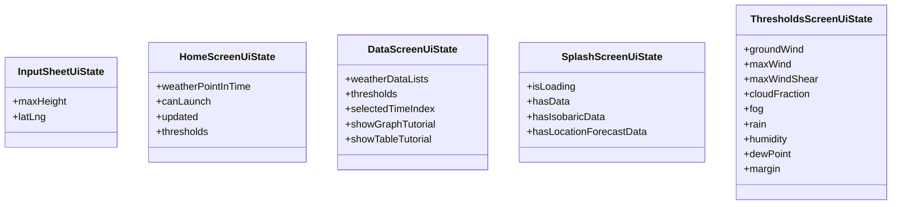
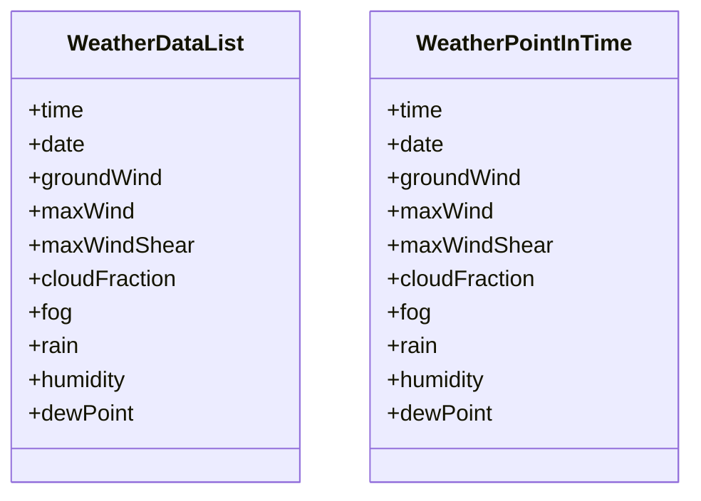

```mermaid
classDiagram 

    SplashScreen ..> SplashScreenViewModel: user input
    InputSheet ..> InputSheetViewModel: user input
    HomeScreen ..> HomeScreenViewModel: user input
    DataScreen ..> DataScreenViewModel: user input
    ThresholdsScreen ..> ThresholdsScreenViewModel: user input

    SplashScreen <.. SplashScreenViewModel: uiState
    InputSheet <.. InputSheetViewModel: uiState
    HomeScreen <.. HomeScreenViewModel: uiState
    DataScreen <.. DataScreenViewModel: uiState
    ThresholdsScreen <.. ThresholdsScreenViewModel: uiState

    SplashScreen --* SplashScreenViewModel
    InputSheet --* InputSheetViewModel
    HomeScreen --* HomeScreenViewModel
    DataScreen --* DataScreenViewModel
    ThresholdsScreen --* ThresholdsScreenViewModel

    SplashScreenViewModel <.. SettingsRepository: settingsFlow
    InputSheetViewModel <.. SettingsRepository: settingsFlow
    HomeScreenViewModel <.. SettingsRepository: settingsFlow
    DataScreenViewModel <.. SettingsRepository: settingsFlow

    SplashScreenViewModel --o SettingsRepository
    InputSheetViewModel --o SettingsRepository
    HomeScreenViewModel --o SettingsRepository
    DataScreenViewModel --o SettingsRepository

    SplashScreenViewModel <.. Repository: hasData
    InputSheetViewModel <.. Repository: failedToUpdate
    HomeScreenViewModel <.. Repository: weatherDataList
    DataScreenViewModel <.. Repository: weatherDataList

    SplashScreenViewModel --o Repository
    InputSheetViewModel --o Repository
    HomeScreenViewModel --o Repository
    DataScreenViewModel --o Repository

    HomeScreenViewModel <.. ThresholdsRepository: thresholdsFlow
    DataScreenViewModel <.. ThresholdsRepository: thresholdsFlow
    ThresholdsScreenViewModel <.. ThresholdsRepository: thresholdsFlow

    HomeScreenViewModel --o ThresholdsRepository
    DataScreenViewModel --o ThresholdsRepository
    ThresholdsScreenViewModel --o ThresholdsRepository

    SettingsRepository <.. SettingsDataStore: settingsFlow
    SettingsRepository --o SettingsDataStore

    Repository --o IsobaricDataSource
    Repository --o LocationForecastDataSource

    ThresholdsRepository --o ThresholdsDataStore

    


    class Repository{
        +weatherDataList
        +hasLocationForecastData
        +hasIsoBaricData
        +failedToUpdate
        +load()
    }
    class SettingsRepository{
        +settingsFlow
        +setMaxHeight()
        +setLat()
        +setLng()
        +setTime()
        +setGraphShowTutorial()
        +setTableShowTutorial()
    }
    class ThresholdsRepository{
        +ThresholdsFlow
        +setGroundWind()
        +setMaxWind()
        +setMaxWindShear()
        +setCloudFraction()
        +setFog()
        +setRain()
        +setHumidity()
        +setDewPoint()
        +setMargin()
        +reset()
        +resetAll()
    }

    class SettingsDataStore{
        +settingsFlow
        +maxHeight
        +lat
        +lng
        +time
        +graphShowTutorial
        +tableShowTutorial
    }

    class ThresholdsDataStore{
        +groundWind
        +maxWind
        +maxWindShear
        +cloudFraction
        +fog
        +rain
        +humidity
        +dewPoint
        +margin
    }

    class LocationForecastDataSource{
        +fetchLocationforecast()
    }

    class IsobaricDataSource{
        +getData()
    }

    class InputSheetViewModel{
        +repository
        +settingsRepository
        +failedToUpdate
        +inputSheetUiState
        +setMaxHeight()
        +setLat()
        +setLng()
        +rollback()
    }
    class HomeScreenViewModel{
        +repository
        +settingsRepository
        +thresholdsRepository
        +homeScreenUiState
    }

    class DataScreenViewModel{
        +repository
        +settingsRepository
        +thresholdsRepository
        +dataScreenUiState
        +setTimeIndex()
        +dontShowTableTutorialAgain()
        +dontShowGraphTutorialAgain()
    }

    

    class SplashScreenViewModel{
        +repository
        +settingsRepository
        +splashScreenUiState
    }

    class ThresholdsScreenViewModel{
        +thresholdsRepository
        +thresholdsUiState
        +setGroundWind()
        +setMaxWind()
        +setMaxWindShear()
        +setCloudFraction()
        +setFog()
        +setRain()
        +setHumidity()
        +setDewPoint()
        +setMargin()
        +reset()
        +resetAll()
    }
    

```

```mermaid
classDiagram
    class InputSheetUiState{
        +maxHeight
        +latLng
    }
        class HomeScreenUiState{
        +weatherPointInTime
        +canLaunch
        +updated
        +thresholds
    }

    class DataScreenUiState{
        +weatherDataLists
        +thresholds
        +selectedTimeIndex
        +showGraphTutorial
        +showTableTutorial
    }

    class SplashScreenUiState{
        +isLoading
        +hasData
        +hasIsobaricData
        +hasLocationForecastData
    }

        class ThresholdsScreenUiState{
        +groundWind
        +maxWind
        +maxWindShear
        +cloudFraction
        +fog
        +rain
        +humidity
        +dewPoint
        +margin
    } 
```

```mermaid
classDiagram
        class WeatherDataList{
        +time
        +date
        +groundWind
        +maxWind
        +maxWindShear
        +cloudFraction
        +fog
        +rain
        +humidity
        +dewPoint
    }
    class WeatherPointInTime{
        +time
        +date
        +groundWind
        +maxWind
        +maxWindShear
        +cloudFraction
        +fog
        +rain
        +humidity
        +dewPoint
    }
```