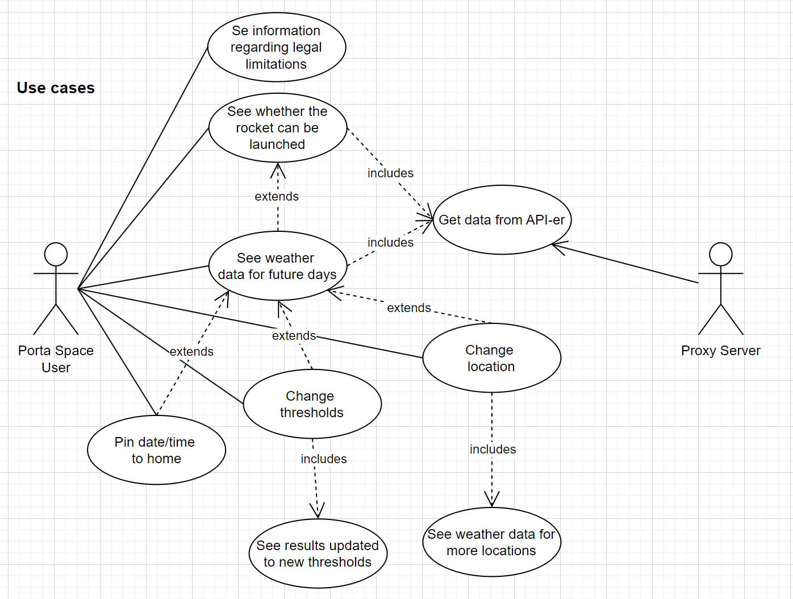
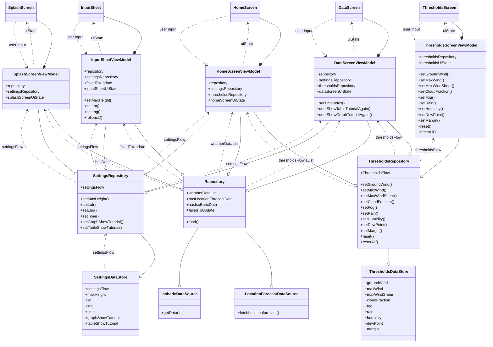
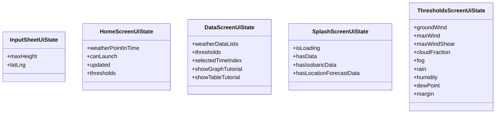
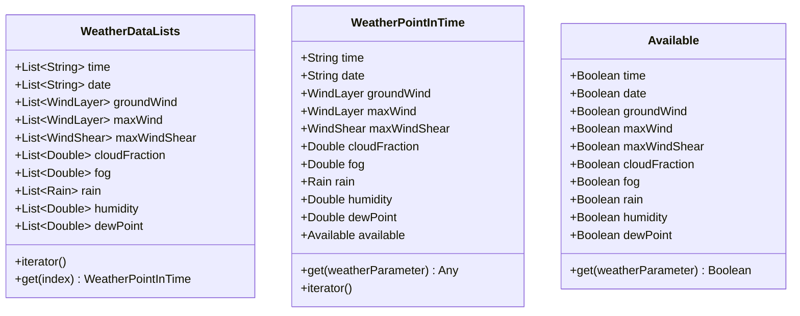
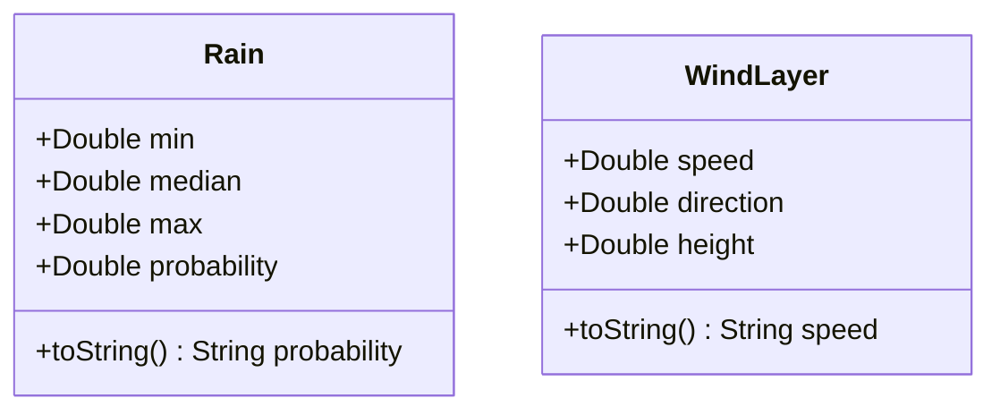
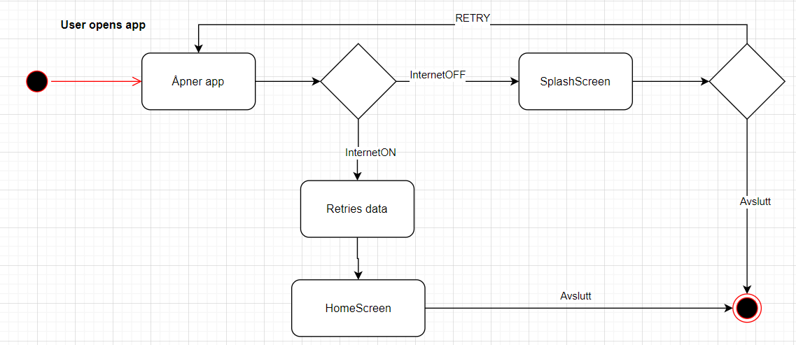
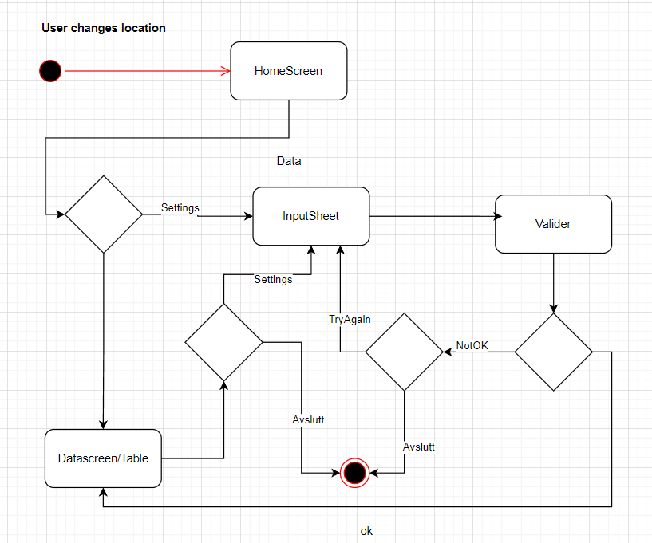
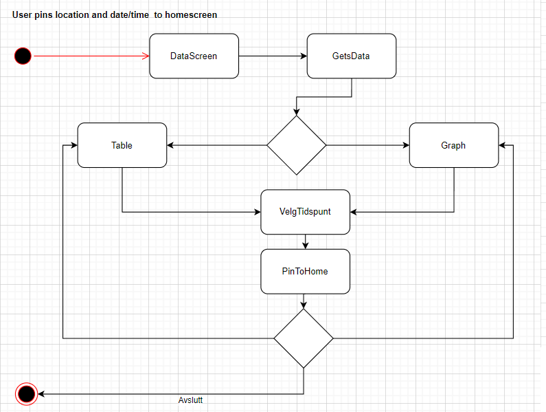

# Modellering og systemdesign

## ● (1) De viktigste funksjonelle kravene til applikasjonen bør beskrives – bruk gjerne use case diagram,samt sekvensdiagram og tekstlig beskrivelse av de viktigste use-casene

## ● (2) Modelleringen bør også inneholde klassediagram som reflekterer use-case og sekvensdiagrammene

## ● (3) Andre diagrammer bør også være inkludert for å få frem andre perspektiver, for eksempel aktivitetsdiagram (flytdiagram) eller tilstandsdiagram

## ● (1) De viktigste funksjonelle kravene til applikasjonen

De viktigste funksjonelle kravene til appen vår er følgende:

Brukeren kan se på tre forskjellige måter om det er forsvarlig å skyte opp en rakett.

Brukeren kan endre instillinger som lokasjon og thresholds for hvor data er hentet fra. I tillegg får brukeren vist informasjon for nye lokasjoner og beregninger for nye thresholds.

Brukeren kan velge å følge med på et valgt tidspunkt og lokasjon på hjemskjermen, hvis f.eks.
det er ønskelig å følge med på framtidig informasjon på en lett måte.

### Tekstlig beskrivelse av de viktigste use-casene

Viktige usecaser er å åpne appen og se data på hjemskjermen, endre lokasjon/threshold. I tillegg til å feste ønskelig lokasjon og tidspunkt til hjemskjermen.

Use-case navn: Åpne appen og se data på hjemskjermen

Aktør: Bruker

Prebetingelser: Ingen

Postbetingelser: Brukeren ser om et oppskytningsvindu er godkjent, ikke godkjent eller rundt grensen for å skyte opp raketten.

Hovedflyt:

1. Brukeren åpner appen.
2. Brukeren har internett tilgang og ser skjermen med relevant data.

Alternativ flyt

1.1 Brukeren har ikke internett.

1.2 Brukeren ser splashscreen og trykker på "Retry".

1.3 Brukeren returnerer til steg 1 i hovedflytten.

Use-case navn: Bruker navigerer til tabellscreen og endrer lokasjon

Aktør: Bruker

Prebetingelser: Brukeren er på hjemskjermen i appen og har internet.

Postbetingelser: Brukeren ser om et oppskytningsvindu er godkjent, ikke godkjent eller rundt grensen for å skyte opp raketten på den nye lokasjonen.

Hovedflyt:

1. Brukeren trykker på Data
2. Brukeren ser tabellen med data og scroller til høyre for å se på data
3. Brukeren trykker på settings.
4. Brukeren endrer lokasjon.
5. Brukeren går tilbake til data-skjermen og ser på data for ny lokasjon.

Use-case navn: Brukeren fester tidspunkt til hjemskjermen

Aktør: Bruker

Prebetingelser: Brukeren er på dataskjermen og ser på graf.

Postbetingelser: Brukeren har festet tidspunkt til hjemskjermen.

Hovedflyt:

1. Brukeren ser på graf og blar til høyre fram til de finner tidspunkt man kan skyte opp raketten.
2. Brukeren trykker på grafen og ser hvilken dato og tid det er.
3. Brukeren er spurt om det er ønskelig å festw tidspunkt til hjemskjermen.
4. Brukeren trykker på knappen for å feste tidspunkt.

### Use-cases Diagram

## Sequence Diagrams

## ● (2) Klassediagram

I dette klassediagrammet har vi valgt å fokusere mest på dataflyten. Disse forenklingene er gjort for å få diagrammet mer oversiktlig:

* Skjermene vises som klasser selv om de egentlig er Composable funksjoner
* typen til variablene og returverdiene til metodene vises ikke
* Vi har utelatt de detaljerte forholdene mellom klassene da det varierer lite mellom Jetpack Compose prosjekter

ui-state dataklassene ser slik ut for de forskjellige klassene:

Modellen vår består i hovedsak av disse klassene. Vi har noen flere som brukes til mellomregning for å finne maxWind og maxWindShear i tillegg til enum klassen WeatherParameter som vi bruker til å hente ut en parameter fra modellen:

Syntaksen for bruk av Availableklassen er slik:

weatherDataLists.get(index).available.get(weatherParameter)

Iteratoren til WeatherDataList returnerer en liste med Pair < WeatherParameter, List < Any > >

Parametrene rain, groundWind, maxWind og maxWindShear er egne dataklasser da de har flere verdier som vi vil bruke. Et eksempel er WindLayer klassen og Rain klassen:

Vi har overskrevet toString metodene til å returnere den verdien vi vil vise i brukergrensesnittet. Dette senker kompleksiteten når vi henter ut verdiene.

## ● (3) Andre diagrammer

### Aktivitetsdiagrammer

>
