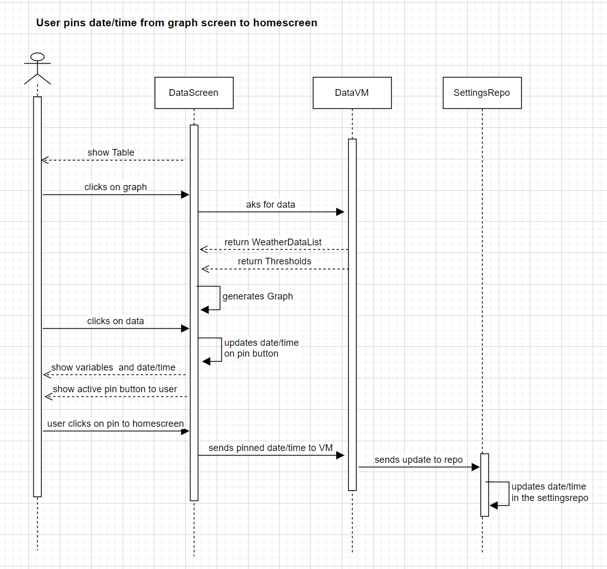

<h1> Modellering og systemdesign </h1>
<h3>● (1) De viktigste funksjonelle kravene til applikasjonen bør beskrives – bruk gjerne use case
diagram,samt sekvensdiagram og tekstlig beskrivelse av de viktigste use-casene.</h3>
<h3>● (2) Modelleringen bør også inneholde klassediagram som reflekterer use-case og sekvensdiagrammene.</h3>
<h3>● (3) Andre diagrammer bør også være inkludert for å få frem andre perspektiver, for eksempel
aktivitetsdiagram (flytdiagram) eller tilstandsdiagram.</h3>

<h2> ● (1) De viktigste funksjonelle kravene til applikasjonen </h2>

De viktigste funksjonelle kravene til appen vår er følgende: 
Brukeren kan se på tre forskjellige måter om det går an eller ikke å skyte opp en rakett.  
Brukeren kan endre instillinger som lokasjon og thresholds for hvor data er hentet fra 
og får vist informasjon for nye lokasjoner og beregninger for nye thresholds.  
Brukeren kan velge å følge med på hjemmeskjermen en valg tidspunt og lokasjon hvis f.eks. 
det er ønskelig å følge med framtidig informasjon på en lett måte.

<h3>Tekstlig beskrivelse av de viktigste use-casene: </h3>

Viktige usecase er å åpne appen og se data på hjemmeskjermen, endre lokasjon/thresholds 
og pinne ønskelig lokasjon og tidspunkt til hjemmeskjermen. 

Use-case navn: Åpne appen og se data på hjemmeskjermen:  
Aktør: PortalSpace user 
Prebetingelser: Ingen. 
Potbestingelser: Brukeren ser om det er mulig, ikke mulig eller innimelom å skyte opp 
PortalSpace sin rakett. 
Hovedflyt:  
1. Brukeren åpner appen. 
2. Brukeren har internett tilgang og ser skjermen med relevant data. 
Alternativ flyt 
1.1 Brukeren har ikke internett. 
1.2 Brukeren ser splashscreen og trykker på "Retry". 
1.3 Brukeren returnerer til steg 1 i hovedflytten. 

Use-case navn: User navigates to table screen and changes location  
Aktør: PortalSpace user 
Prebetingelser: Brukeren er på hjemmeskjermen i appen og har internet. 
Potbestingelser: Brukeren ser data frem i tid for om det er mulig, ikke mulig eller innimelom å skyte opp 
PortalSpace sin rakett. 
Hovedflyt:  
1. Brukeren trykker på Data. 
2. Brukeren ser tabellen med data og scroller til høyre for å se på data 
3. Brukeren trykker på settings. 
4. Brukeren endrer lokasjon. 
5. Brukeren går tilbake til data-skjermen og ser på data for ny lokasjon. 

Use-case navn: Brukeren pins tidspunkt og lokasjon til hjemmeskjerm  
Aktør: PortalSpace user 
Prebetingelser: Brukeren er på dataskjermen og ser på graf. 
Potbestingelser: Brukeren har pinned tidspunkt og lokasjon til hjemmeskjerm. 
Hovedflyt:  
1. Brukeren ser på graf og scroller til høyre fram til den finner tidspunt man kan skyte opp raketten. 
2. Brukeren trykker på grafen og ser hvilen dato og tid den er.  
3. Brukeren er spurt om det er ønskelig å pinne tidspunkt til hjemmeskjermen. 
4. Brukeren trykker på knappen for å pinne tidspunkt. 

<h3> Use-cases Diagram:</h3>

<h3> Sequence Diagrams: </h3>

<h2> ● (2) Klassediagram </h2>

<h2> ● (3) Andre diagrammer </h2>