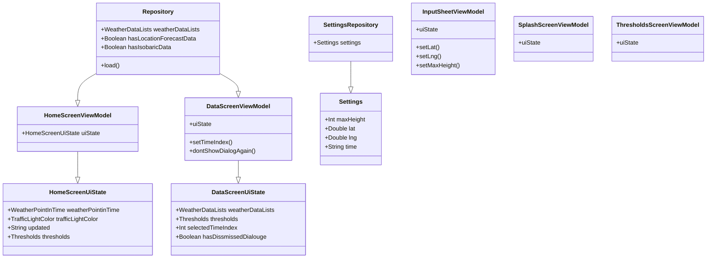

<h1> Modellering og systemdesign </h1>
<h3>● (1) De viktigste funksjonelle kravene til applikasjonen bør beskrives – bruk gjerne use case
diagram,samt sekvensdiagram og tekstlig beskrivelse av de viktigste use-casene.</h3>
<h3>● (2) Modelleringen bør også inneholde klassediagram som reflekterer use-case og sekvensdiagrammene.</h3>
<h3>● (3) Andre diagrammer bør også være inkludert for å få frem andre perspektiver, for eksempel
aktivitetsdiagram (flytdiagram) eller tilstandsdiagram.</h3>

<h2> ● (1) De viktigste funksjonelle kravene til applikasjonen </h2>
<h3>
    Tekstlig beskrivelse av de viktigste use-casene: </h3>

BESKRIVELSE

<h3> Use-case Diagrams:</h3>

<h3> Sequence Diagrams: </h3>

<h2> ● (2) klassediagram </h2>

<h2> ● (3) Andre diagrammer </h2>
