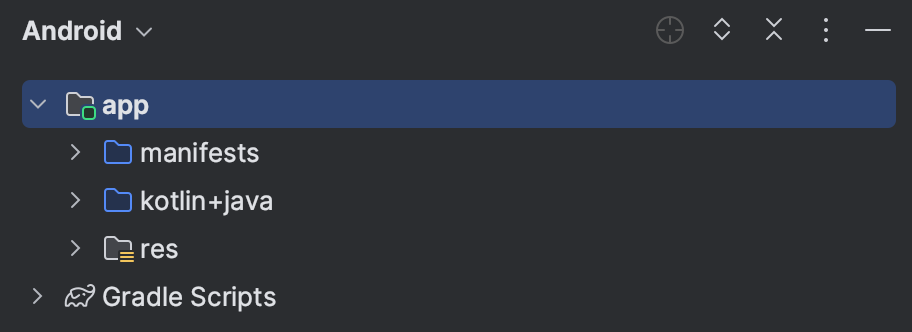
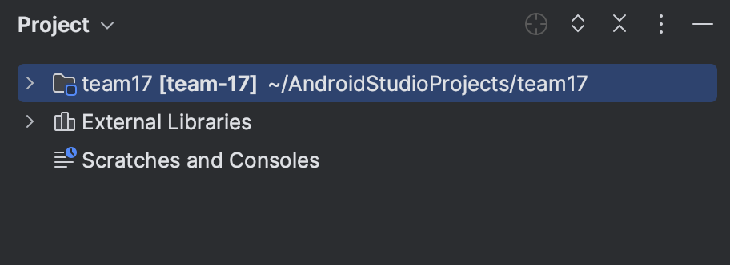
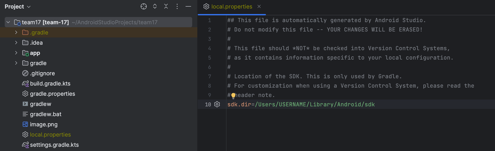

# team-17

for å kunne kjøre prosjektet i android studio må mann ha sin egen local.properties fil. Denne filen blir vanligvis automatisk generert av android studio
og må genereres på din pc da den avhenger av hvordan du har installert android studio og av operativsystemet ditt. Det enkleste er å kopiere filen fra et
annet prosjekt.

  
  ->
  

om du har en mac ser typisk filen noe som dette ut ^
