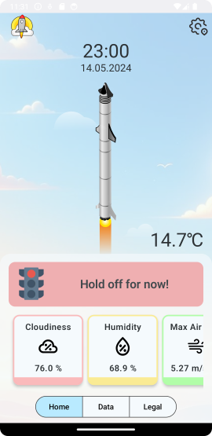
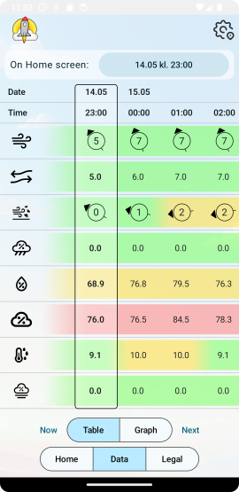

## Table of Contents
- [Background](#background)
- [Screenshots](#screenshots)
- [Documentation](#documentation)
- [Install](#install)
- [Usage](#usage)
- [API](#api)
- [Contributing](#contributing)

## About
LiftOff is an application that provides a weather forecast for both ground and atmospheric pressure points. The app can store and use thresholds set by you to calculate "safe" rocket launch time-periods. The application is developed by a team of 6 people.
The team consists of students from the University of Oslo taking the course IN2000 - Software Engineering.

## Background
We were approached with multiple cases, and we chose to work on the case "Weather data for a safe rocket launch". 
We have worked closely with the student organization [Portal Space](https://www.portalspace.no/), catering features, design, and functionality to their needs.
## Screenshots


## Documentation
Information on the applications architecture and further maintaining, will be found here. [ARCHITECTURE.md](ARCHITECTURE.md)

Graphs and system design will be found here. [MODELING.md](MODELING.md)

Documentation on weatherDTO and how to use it will be found here. [weatherDTO_Documentation.md](app/src/main/java/no/uio/ifi/in2000/team_17/data/locationforecast/weatherDTO/weatherDTO_Documentation.md)

## Install
#### Requirements
- Emulator or physical device running Android 8.0 (API level 26) or higher
- Either a clone of this repository or the APK file

#### Apk file
To install on a physical device, we recommend using Android Debug Bridge [(adb)](https://developer.android.com/tools/adb)
```sh
$ adb install ~/file/path/release.apk
```

#### Project Files
We recommend android studio for emulating the application through the project folders.
Clone the repository, and run trough android studio.
```sh
$ git clone https://github.uio.no/IN2000-V24/team-17.git
```
You will need permissions to clone all the files.
## Usage
Run the application on an emulator or physical device. The application will guide you on usage. There are multiple features to explore, such as setting thresholds, viewing weather data, and viewing the forecast.

## API
We have used the following API's in our application:
- [Locationforecast](https://api.met.no/weatherapi/locationforecast/2.0/documentation)
  - This API is used to get the weather forecast data for the rocket launch.
- [IsobaricGRIB](https://api.met.no/weatherapi/isobaricgrib/1.0/documentation)
  - This API is used to get the atmospheric pressure data for the rocket launch.
  - Fetching, parsing and formatting is done by a secondary api we are hosting at NREC. The original api is created by MET. [EDR-Isobaric](https://github.com/metno/edrisobaric)
  - We have modified EDR-Isobaric to better suite our problems and to make it easier to use in our application. Although this is never ran through the application we have decided to add the folder to our project folders for documentation. This is found in the [isobaricgrib](app/src/main/java/no/uio/ifi/in2000/team_17/data/isobaricgrib) folder.

## Contributing
- Amandus Guldahl - [amandug](https://github.uio.no/amandug)
- Hedda Johnsen - [heddjo](https://github.uio.no/heddjo)
- Lelia-Marcela Marcau - [leliamm](https://github.uio.no/leliamm)
- Malin Kristine Bjørnstadjordet - [malinkbj](https://github.uio.no/malinkbj)
- Sander Norheim - [sandern](https://github.uio.no/sandern)
- Samuel Valland Lyngset - [samuelvl](https://github.uio.no/samuelvl)