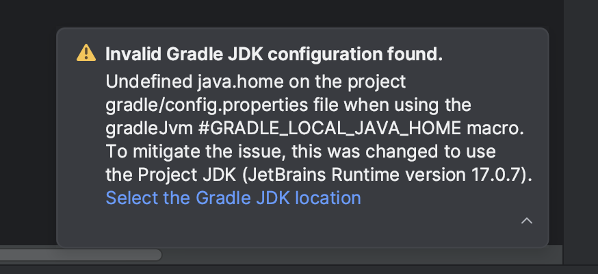

# team-17
Dersom du får denne advarselen:

kan det være at android studio ikke oppretter local.properties filen riktig. I så fall kan du bare kopiere den fra et annet prosjekt. 
Endre fra "Android" til "Project" og kopier local.properties fra et prosjekt du har opprettet lokalt som dette:

  
  ->
  

om du har en mac ser typisk filen noe som dette ut ^
